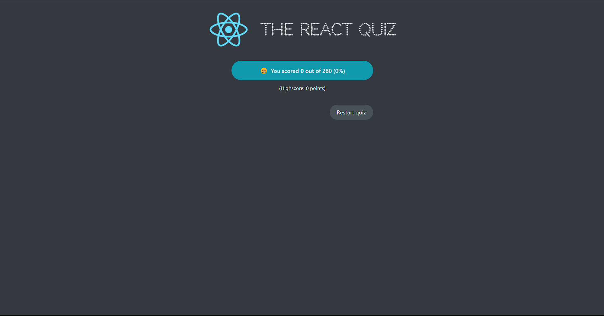

This Project is used to review knowledge for student.

Project starts with Start Screen:

Let's start button is clicked. we will start with first question:

Choose answer and it is indented and progress bar will increase

When click next button, second question appear:

Choose answer and familiar thing appears:

When you reach the final question and progress bar is full:

When you click Finish button, then:
If your percentage is 0:

If your score is lower than average (< 50%):

If your score is higher than average (> 50%):

If your score is approximately full (< 100%):

If your score is max (= 100%):

And finally when you click button 'Restart Quiz', you will come back to Start Screen:

